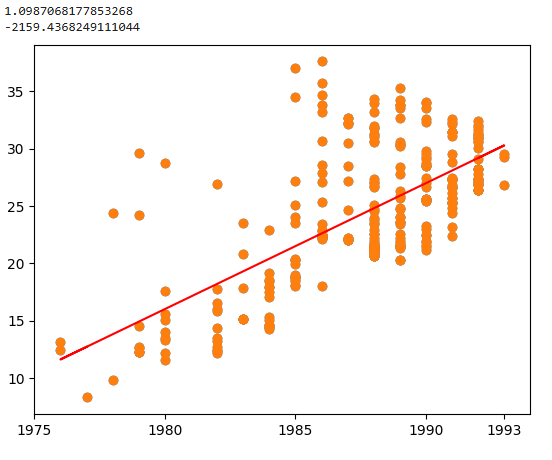

# Quando serei Procurador de Justiça?

A regressão linear é uma técnica de machine learning, do tipo aprendizado supervisionado.

É bastante usada em problemas de regressão, isto é, aqueles em que se deseja fazer previsões a partir de dados conhecidos do passado.

Neste projeto, tentamos encontrar a relação linear entre as variáveis "ano de ingresso na carreira" e "anos decorridos até a promoção a Procurador de Justiça", extraídas da lista de antiguidade mais recente (01/2025), usando a função `polyfit` da biblioteca `numpy`.

O modelo busca um padrão dos dados, e, como é de se esperar, não captura a complexidade da movimentação da carreira, que depende de circunstâncias temporais e do conjunto de decisões individuais dos colegas determinantes de suas posições em termos de antiguidade.



Os valores do coeficiente angular e intecepto encontrados são 1.0987068177853268 e -2159.4368249111044, respectivamente.

A fórmula de cálculo usada na aplicação é, portanto:

```python 
resultado = (int(ano_de_ingresso * 1.0987068177853268 -2159.4368249111044 + ano_de_ingresso))
```

Confira como chegamos à função em: https://github.com/jespimentel/perfil_mpsp/blob/main/perfil_membros_mpsp_2024_01.ipynb
